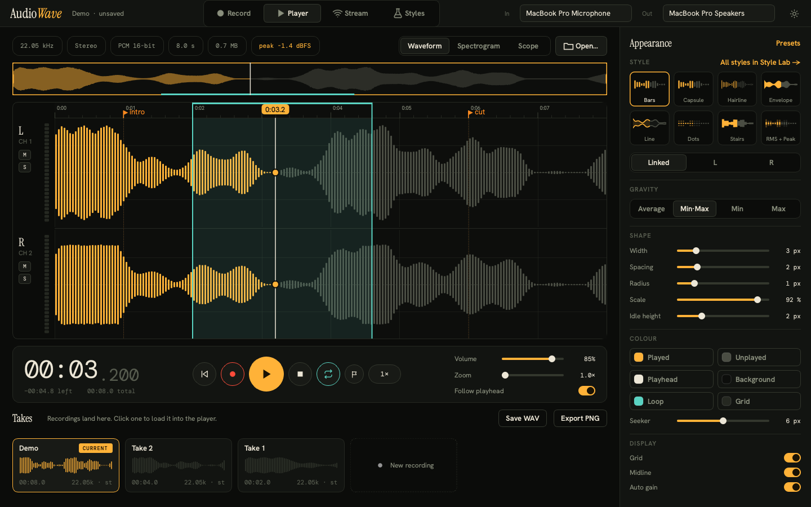

# AudioWave

Audio waveform widgets, analysis and playback for **PySide6**, plus **AudioWave Studio**, a desktop app
that shows what the library can do.



- **`audiowave`** is the library. It knows nothing about the app.
- **`studio`** is the demo app. It is built only from the library's public API.

## Quick start

```sh
uv venv && uv pip install -e ".[dev]"     # or: python -m venv .venv && pip install -e ".[dev]"
python -m studio                          # or: audiowave-studio [file.wav]
```

Requires Python 3.10+. Playback and recording use QtMultimedia, so on macOS the first recording asks for
microphone access.

## The library in 20 lines

```python
from PySide6.QtWidgets import QApplication
from audiowave import Appearance, AudioClip
from audiowave.audio import AudioPlayer
from audiowave.binding import bind_player
from audiowave.widgets import OverviewView, Viewport, WaveformView

app = QApplication([])
clip = AudioClip.from_wav("song.wav")

viewport = Viewport()  # shared: overview and waveform scroll/zoom together
waveform, overview = WaveformView(viewport), OverviewView(viewport)
waveform.set_appearance(Appearance(style="capsule"))
waveform.set_clip(clip)
overview.set_clip(clip, waveform.clip_peaks)

player = AudioPlayer()
player.load(clip)
bind_player(player, waveform, overview)  # playhead, click-to-seek, loop region, follow
waveform.show()
player.play()
app.exec()
```

Runnable versions are in [`examples/`](examples): a minimal player and a custom waveform style.

### Layers

Dependencies only point downwards; nothing in a lower layer imports a higher one.

| Layer | Needs | What it does |
|-------|-------|--------------|
| `audiowave.core` | numpy | `AudioClip` (WAV in/out, 8/16/24/32-bit and float), peak envelopes with fast zoom (`ClipPeaks`), incremental envelopes for live audio (`LivePeaks`), analysis (spectrogram, stereo image, levels, silence detection) |
| `audiowave.appearance` | nothing | Immutable `Appearance` / `Palette` value objects, JSON-serialisable |
| `audiowave.audio` | QtMultimedia | `AudioPlayer` (device-accurate position, seek, gapless loop, volume, varispeed, per-channel gain), `AudioRecorder`, device listing |
| `audiowave.widgets` | QtWidgets | `WaveformView`, `OverviewView`, `SpectrogramView`, `VectorscopeView`, `LiveWaveformView`, `LevelMeter` and the painter registry |
| `audiowave.binding` | audio + widgets | `bind_player`: the only place a player meets a view |

`import audiowave` itself pulls in no Qt, so the core is usable in scripts and services.

### Waveform styles

Ten built-in styles, chosen by name: `bars`, `capsule`, `hair`, `env`, `line`, `stairs`, `dots`, `rms`, `ground`,
`radial`. A style is one class decorated with `@register`, and it automatically gets played/unplayed colouring,
caching, gravity, scale and idle height. See [`examples/custom_style.py`](examples/custom_style.py).

## AudioWave Studio

| Page | What you can do |
|------|-----------------|
| **Player** | Open or drop a `.wav`; click/drag to seek; drag on the ruler to loop; markers; zoom, scroll and an overview; speed 0.5–2×; mute/solo and level meters per channel; waveform / spectrogram / vectorscope views; takes; export PNG |
| **Record** | Choose mono/stereo and rate, watch a live waveform and level meters, and keep the result as a take |
| **Stream** | Send audio to another studio over TCP, or receive it. Sender: start a server, stream the microphone live, or send a take. Receiver: connect, watch frames arrive, play the recording |
| **Styles** | All waveform styles and analysis views side by side, live; click one to use it |

The inspector on the right edits the appearance of the linked channels, or L and R separately, and offers
presets. **Shortcuts:** `Space` play/pause · `M` marker · `L` loop · `R` record · `Ctrl/Cmd+O` open.

More: [docs/architecture.md](docs/architecture.md) for the design, [docs/design/ui-proposal.md](docs/design/ui-proposal.md)
for the original UI proposal.

## Development

```sh
pytest                       # 150+ tests: core maths, painters, widgets, audio device, TCP streaming, the whole app
ruff check . && ruff format .
python scripts/screenshots.py    # regenerate docs/screenshots from the real app
```

Tests run headless (`QT_QPA_PLATFORM=offscreen`). The audio-device tests play at volume 0 and are skipped on
machines with no output device.

## Migrating from 0.1

The 0.1 code (still in git history) was rewritten rather than patched. Old to new:

| 0.1 | Now |
|-----|-----|
| `AudioWave` (byte arrays, channel splitting) | `AudioClip` |
| `AudioWaveChannel` (`minimums`/`maximums`, `sample`, `scale`) | `Peaks`, `PeakPyramid`, `ClipPeaks` |
| `AudioWaveFormOptions` (18 mutable fields + setters) | `Appearance` + `Palette` (immutable; `with_(...)`) |
| `AudioWaveForm`, `FixedLiveAudioWaveForm` | `WaveformView` with `set_position` |
| `LiveAudioWaveForm`, `LiveAudioWaveFormChannel` | `LiveWaveformView` + `LivePeaks` |
| `AudioWavePlayer`, `AudioWaveRecorder`, `TimedLiveAudioWave*` | `AudioPlayer`, `AudioRecorder` (signals: `positionChanged`, `stateChanged`) |
| `py_audiowave` (PyAudio) | removed; QtMultimedia is the only audio backend |
| `mimi_wave_ui` (Tk and Qt) | `studio.stream` and the Stream page; the Tk UI is gone |

### What became of Mimi Wave

Everything the old sender and receiver did is on the Stream page, with the same roles: the **sender is the server**.

| Old control | Now |
|-------------|-----|
| Start Server / Stop Server, port 6000–9000 | Start server / Stop server, port field limited to 6000–9000 |
| Record / Stop Recording | Record page, or **Stream microphone** to send it live |
| Send Recorded | **Send current take** |
| Server IP, Connect / Disconnect | Host, Connect / Disconnect (receiver) |
| Play Recording | **Play recording** (receiver adds the received audio as a take and plays it) |
| "Frame \| Size" label | `N F \| X MB` readout plus a frames table |

Differences: frames are now length-prefixed instead of separated by `<<>>` (which would split any frame whose audio
happened to contain those bytes), so old and new versions cannot talk to each other; there are no threads (Qt sockets on the event loop);
and a receiver that joins mid-stream gets the format header first.

## Limitations

- WAV only (PCM 8/16/24/32-bit and 32-bit float). Other formats are not decoded.
- Speed is varispeed: pitch changes with speed.
- The appearance model holds two channels (L, R). Clips with more channels render, but share R's appearance.
- Recording and microphone streaming go through the real input device and need OS permission, so they are not
  covered by the automated tests; playback and TCP streaming are.

## License

GPL-3.0, see [LICENSE](LICENSE). Bundled fonts (Instrument Serif, Hanken Grotesk, DM Mono) are under the SIL Open Font
License; their licences are in `studio/resources/fonts/`.
