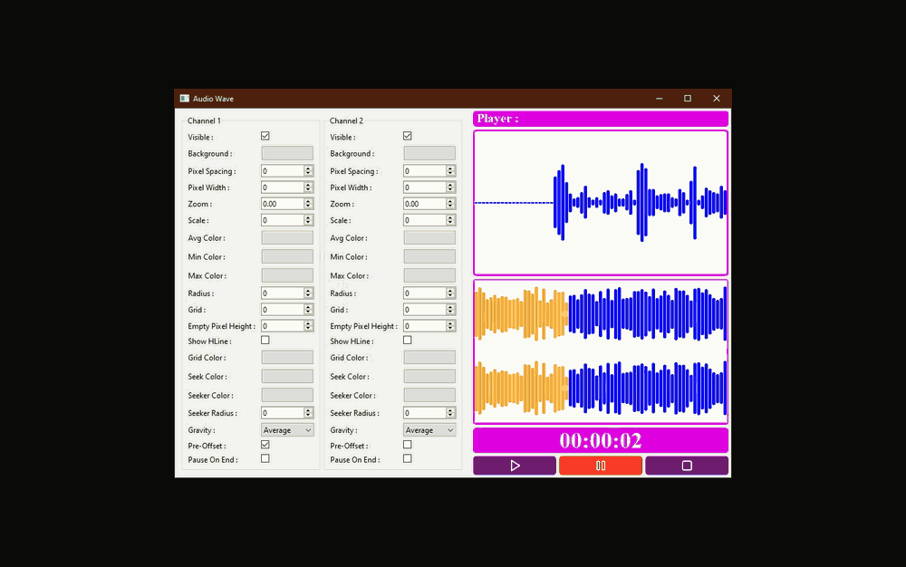
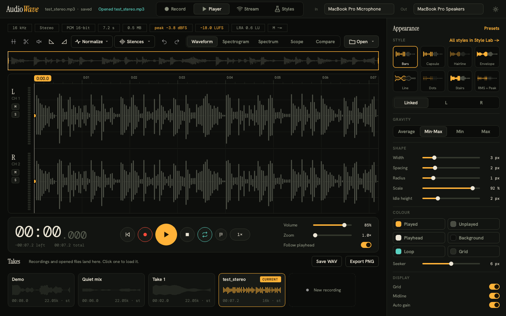
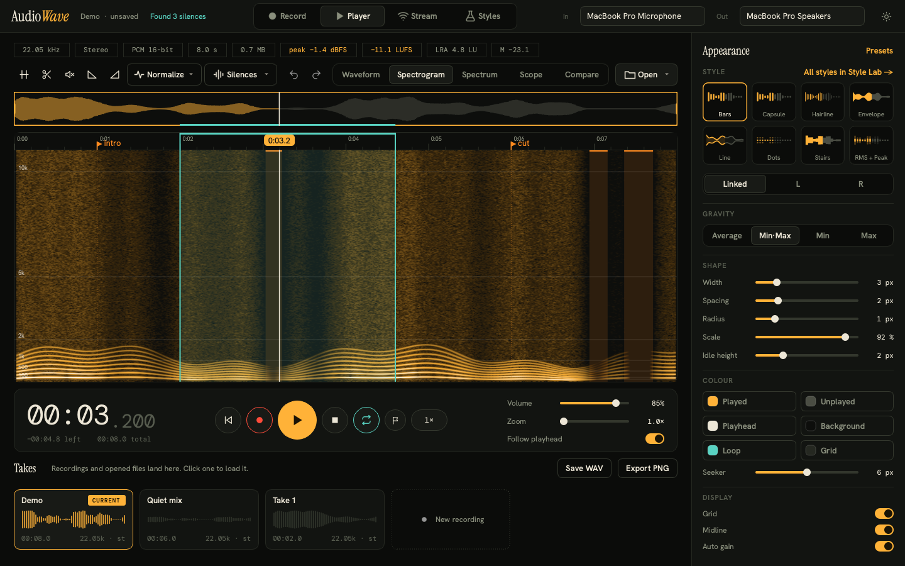
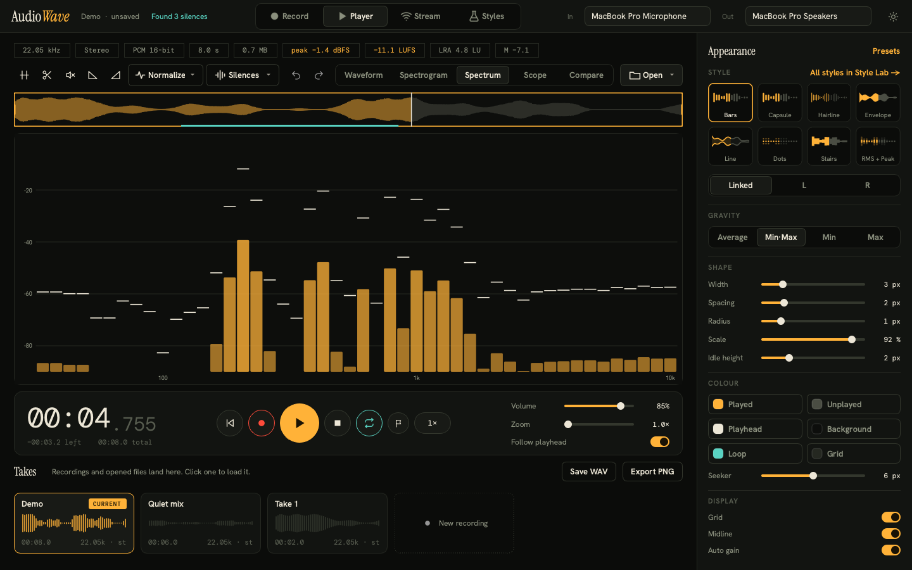
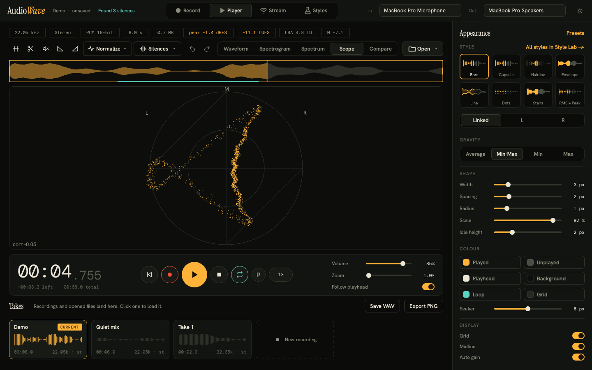
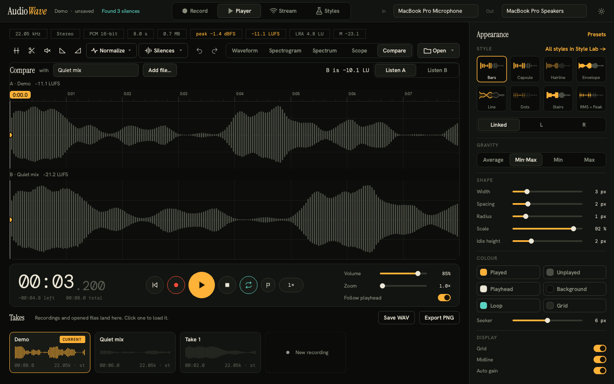
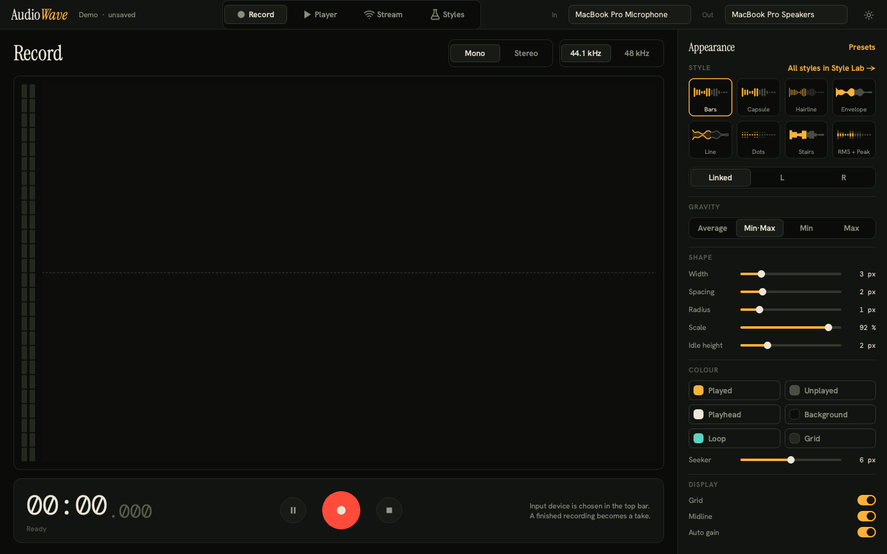
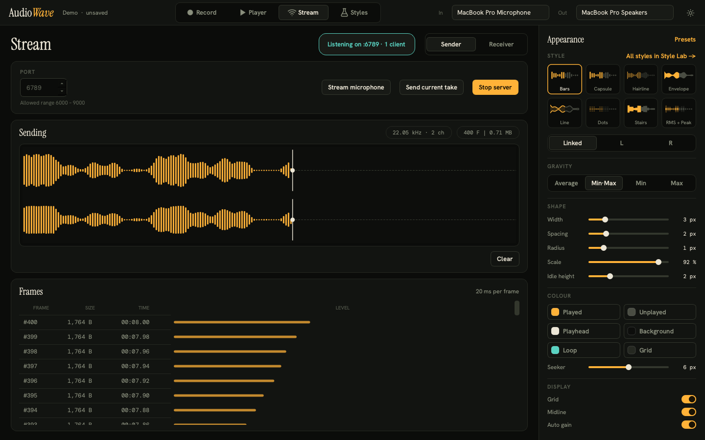
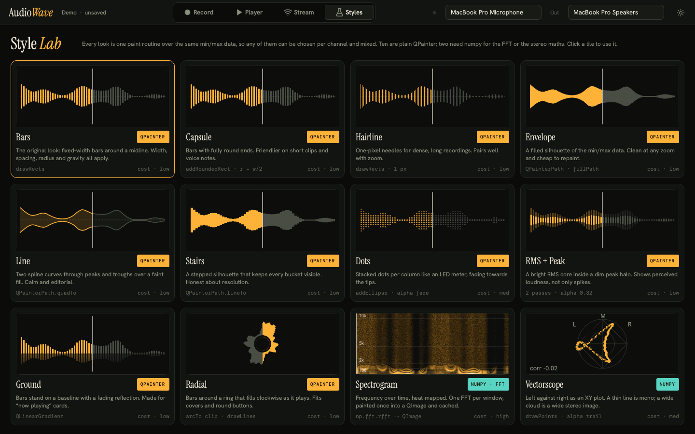
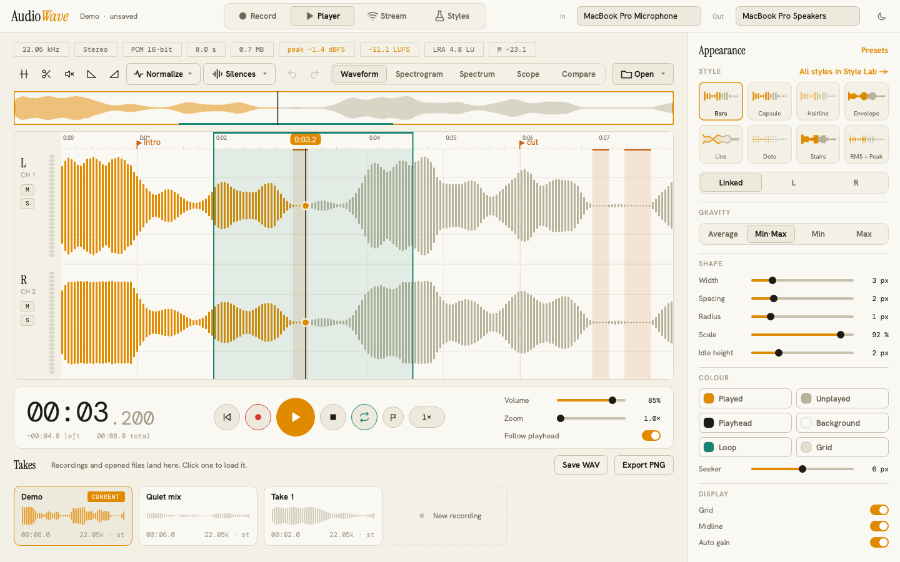

# AudioWave

**Waveforms, analysis and audio editing for Python and Qt.** AudioWave is a PySide6 library for showing, playing,
measuring and editing audio, plus **AudioWave Studio**, a desktop app built only on the library to show what it can do.


- **Ten waveform styles** (bars, capsule, hairline, envelope, line, stairs, dots, RMS + peak, ground, radial) that you
  can mix per channel, restyle live and extend with one class.
- **Views that stay in sync:** waveform, overview, spectrogram, live spectrum analyser, vectorscope, level meters.
- **Real measurement:** ITU-R BS.1770 loudness (momentary, short-term, integrated LUFS, range), spectra, stereo image,
  silence detection.
- **Editing with undo:** trim, cut, fade, silence, normalise to a peak or LUFS target, remove silences.
- **Plays and records** through QtMultimedia: a playhead driven by the device clock, gapless loops, seek, speed, per-channel
  mute/solo, live waveform while recording.
- **Reads WAV, MP3 and more** (FLAC, Ogg, M4A depending on your Qt build) with no extra dependency.
- **A Qt-free core:** `import audiowave` needs only numpy, so the maths is usable in scripts and servers.
- **Tested:** over 200 tests, including real playback, real MP3 decoding, real TCP streaming, and every code sample in
  this README.

## See it in motion



<sub>A 40-second scroll from the old 0.1 UI through every screen below. Silent. Full quality:
[audiowave-tour.mp4](docs/media/audiowave-tour.mp4).</sub>

## Contents

1. [Install and run](#install-and-run)
2. [AudioWave Studio: a tour](#audiowave-studio-a-tour)
3. [Studio reference: shortcuts, gestures, formats](#studio-reference)
4. [Using the library](#using-the-library)
5. [API at a glance](#api-at-a-glance)
6. [Platform notes and troubleshooting](#platform-notes-and-troubleshooting)
7. [Project layout and development](#project-layout-and-development)
8. [Migrating from 0.1](#migrating-from-01) · [Limitations](#limitations) · [License](#license)

---

## Install and run

Requires **Python 3.10+**, numpy, and PySide6 6.6 or newer (developed against 6.11).

```sh
git clone <this repository> && cd audiowave
uv venv && uv pip install -e ".[dev]"        # or: python -m venv .venv && .venv/bin/pip install -e ".[dev]"

python -m studio                             # start AudioWave Studio (or: audiowave-studio)
python -m studio path/to/song.mp3            # ...and open a file right away
```

`[dev]` adds pytest, ruff and `lameenc` (used only to build MP3 test files). To use just the library in another
project, install the folder into that project's environment with `pip install -e /path/to/audiowave`.

---

## AudioWave Studio: a tour

Studio opens with a synthetic voice-like clip so there is something to explore. Drop any `.wav` or `.mp3` onto the
window, or press <kbd>Ctrl/⌘</kbd>+<kbd>O</kbd>.

### Player: see it, measure it, edit it


- **Info row:** sample rate, channels, source format, duration, size, peak, then **integrated loudness (LUFS)**,
  **loudness range (LRA)** and a **live momentary loudness** reading that follows the playhead.
- **Edit toolbar:** trim, cut, silence, fade in/out, **Normalize** (peak −1 dBFS, or −14 / −16 / −23 LUFS) and
  **Silences** (find, trim the ends, remove them all), plus undo and redo. Work happens in the background, so the UI never
  freezes.
- **Selection = loop:** drag on the ruler to select a region. It loops on playback (gapless) and is what trim, cut and fades act on.
- **Markers, zoom, follow:** press <kbd>M</kbd> to drop a marker, zoom with the slider or the wheel, and let the view follow
  the playhead. The overview strip shows the whole clip and a draggable window onto it.
- **Per-channel** mute and solo buttons and level meters; speed from 0.5× to 2×.
- **Silence highlights** (orange bands above) mark what _Find silences_ detected.
- **Takes** keep every recording and opened file; click one to switch. _Save WAV_ and _Export PNG_ are one click away.

### MP3 and friends open like any other file



MP3 (and other compressed formats your Qt build can decode) is decoded in the background with a progress message, then
behaves exactly like a WAV: waveform, loudness, editing, everything. The **Open** menu also remembers your recent files.

### Spectrogram: frequency over time



The spectrogram shares the waveform's timeline, so scrolling, zooming, loop regions, markers and silence highlights all
carry over. It is computed only when you look at it.

### Spectrum analyser: what is playing right now



Forty-eight log-spaced bands of the audio at the playhead, with smooth fall-off and peak-hold ticks. The **Record** page has the
same analyser, live from the microphone.

### Vectorscope: the stereo image



Left against right around the playhead. A mono signal is a vertical line, a wide mix is a cloud, and an out-of-phase one leans
sideways; the correlation reading (+1 mono, −1 out of phase) is printed underneath.

### Compare two takes on one timeline



Pick any two takes. Both are drawn on a shared timeline, each labelled with its loudness, with the **difference in LU** shown
between them. **Listen A / Listen B** switches what you hear without losing your place, even while playing. Handy for
checking a master against the original or a re-take against the last one.

### Record



Choose mono or stereo and 44.1 or 48 kHz, then record with a live scrolling waveform, level meters and a live spectrum. When
you stop, the recording becomes a take. Pick the input and output devices in the top bar.

### Stream audio between two machines



One Studio is the **Sender** (it listens on a port from 6000 to 9000); another is the **Receiver** (it connects to the sender's
address). The sender can **stream the microphone live** or **send the current take**; the receiver watches frames arrive and
can **play the recording** or keep it as a take. The frames table and the `N F | X MB` readout show exactly what moved. Above,
a real sender and receiver are talking over a loopback connection.

### Style Lab



Every waveform style and analysis view side by side, running on the real library painters (nothing is mocked). Click a tile to
use that style everywhere. The inspector on the right does the same with previews, and its controls are hidden when a style does
not use them: no dead sliders.

### Light theme



Every colour comes from one theme object, so switching between dark and light (the sun/moon button, top right) restyles the
app and the waveforms together. The inspector edits both channels together (_Linked_) or **L** and **R** separately, and can
save and load presets.

---

## Studio reference

### Keyboard

| Key                                                                                                | Action                                                                       |
| -------------------------------------------------------------------------------------------------- | ---------------------------------------------------------------------------- |
| <kbd>Space</kbd>                                                                                   | Play / pause                                                                 |
| <kbd>M</kbd> · <kbd>L</kbd> · <kbd>R</kbd>                                                         | Add marker · toggle loop · start / stop recording                            |
| <kbd>Ctrl/⌘</kbd>+<kbd>O</kbd>                                                                     | Open a file                                                                  |
| <kbd>Ctrl/⌘</kbd>+<kbd>Z</kbd> · <kbd>Ctrl/⌘</kbd>+<kbd>Shift</kbd>+<kbd>Z</kbd> (or <kbd>Y</kbd>) | Undo · redo                                                                  |
| <kbd>Delete</kbd> / <kbd>Backspace</kbd> · <kbd>Ctrl/⌘</kbd>+<kbd>T</kbd>                          | Cut the selection · trim to the selection                                    |
| <kbd>←</kbd> <kbd>→</kbd> (with the pointer over the waveform)                                     | Move the playhead 1 s; with <kbd>Shift</kbd> 10 s, with <kbd>Alt</kbd> 0.1 s |
| <kbd>Home</kbd> · <kbd>End</kbd>                                                                   | Jump to the start · end                                                      |
| <kbd>+</kbd> · <kbd>−</kbd> · <kbd>0</kbd> · <kbd>PgUp</kbd> / <kbd>PgDn</kbd>                     | Zoom in · zoom out · fit everything · scroll a page                          |

### Mouse

| Gesture                                       | Action                       |
| --------------------------------------------- | ---------------------------- |
| Click or drag on the waveform                 | Seek                         |
| Drag on the ruler (or <kbd>Shift</kbd>-drag)  | Select / loop a region       |
| Drag a region's edge · double-click inside it | Resize it · clear it         |
| Click a marker flag                           | Jump to it                   |
| <kbd>Ctrl/⌘</kbd> + wheel · plain wheel       | Zoom at the pointer · scroll |
| Drag the overview window or its edges         | Scroll · zoom                |
| Drop a file on the window                     | Open it                      |

### Formats

|            |                                                                                                                                                                                                    |
| ---------- | -------------------------------------------------------------------------------------------------------------------------------------------------------------------------------------------------- |
| **Open**   | WAV (8/16/24/32-bit PCM, 32-bit float, extensible header) directly. MP3, FLAC, Ogg, M4A/AAC, WMA through Qt's FFmpeg-based decoder. MP3 is covered by the tests; the rest depend on your Qt build. |
| **Save**   | WAV (16-bit in Studio; the library also writes 8/24/32-bit and float). MP3 export is not supported.                                                                                                |
| **Stream** | 16-bit PCM over TCP, mono or stereo.                                                                                                                                                               |

---

## Using the library

Everything Studio does goes through this public API. Each example below is executed by the test suite, using a small
stereo file called `song.wav` and an MP3 called `voice.mp3` in place of your own.

### The layers

```
audiowave.core          numpy only    clips, WAV, peaks, loudness, analysis, edits
audiowave.appearance    nothing       Appearance / Palette: how a waveform looks (immutable, JSON-friendly)
audiowave.audio         QtMultimedia  player, recorder, MP3 decoder, devices
audiowave.widgets       QtWidgets     waveform and companion views, painters
audiowave.binding       both          bind_player(): connects a player to views
```

`audiowave.audio` and `audiowave.widgets` do not import each other; `binding` is the one place they meet. Nothing in `core`
imports Qt.

### 1. Show a waveform and play it

<!-- readme-test -->

```python
from PySide6.QtWidgets import QApplication
from audiowave import Appearance, AudioClip
from audiowave.audio import AudioPlayer
from audiowave.binding import bind_player
from audiowave.widgets import OverviewView, Viewport, WaveformView

app = QApplication([])
clip = AudioClip.from_wav("song.wav")

viewport = Viewport()  # shared: overview and waveform scroll and zoom together
waveform, overview = WaveformView(viewport), OverviewView(viewport)
waveform.set_appearance(Appearance(style="capsule"))
waveform.set_clip(clip)
overview.set_clip(clip, waveform.clip_peaks)

player = AudioPlayer()
player.load(clip)
bind_player(player, waveform, overview)  # playhead, click-to-seek, loop region, follow
waveform.show()
player.play()
app.exec()
```

Click or drag to seek, drag on the ruler to loop, hold <kbd>Ctrl/⌘</kbd> and scroll to zoom. A complete, runnable
version is [`examples/waveform_player.py`](examples/waveform_player.py).

### 2. Load, inspect, edit and save (no Qt needed)

<!-- readme-test -->

```python
from audiowave import AudioClip
from audiowave.core import edit, measure_loudness

clip = AudioClip.from_wav("song.wav")  # float32 samples shaped (channels, frames)
print(clip)  # AudioClip(2ch, 16000 Hz, 7.095s)
print(f"peak {clip.peak():.2f}  rms {clip.rms():.3f}  {clip.duration:.1f} s")

part = clip.slice(1.0, 4.0)  # seconds. Every operation returns a NEW clip; clips are immutable
mono = clip.to_mono()

loudness = measure_loudness(clip)
print(f"{loudness.integrated:.1f} LUFS, range {loudness.range:.1f} LU")

silences = edit.silent_ranges(
    clip, threshold_db=-50, min_duration=0.3
)  # [(start, stop), ...] in seconds
tidy = edit.remove_ranges(
    clip, silences
)  # cut them out; each join is crossfaded so it does not click
tidy = edit.fade_out(tidy, 0.5)
tidy, gain_db = edit.normalize_loudness(
    tidy, target_lufs=-16
)  # never clips: the gain stops at the peak ceiling
tidy.to_wav("out.wav")  # 16-bit by default; pass SampleFormat.S24 or F32 for others
```

Because clips are immutable, **undo is just keeping the previous clip**. Studio does exactly that, with a bounded history.
The editing functions are `keep`, `cut`, `remove_ranges`, `fade`, `fade_in`, `fade_out`, `silence_range`, `gain_db`,
`normalize_peak`, `normalize_loudness`, `trim_silence` and `silent_ranges`.

### 3. Open MP3 and other formats

<!-- readme-test -->

```python
from PySide6.QtWidgets import QApplication
from audiowave.audio import AudioDecoder, load_clip

app = QApplication([])

clip = load_clip("voice.mp3")  # simplest: WAV is read directly, anything else is decoded by Qt
print(clip)

# In a GUI, decode without blocking the interface and show progress:
decoder = AudioDecoder()
decoder.progress.connect(lambda fraction: print(f"{fraction:.0%}"))
decoder.decoded.connect(lambda clip: print("got", clip))
decoder.failed.connect(lambda message: print("could not decode:", message))
decoder.decode("voice.mp3")
app.exec()
```

`SUPPORTED_EXTENSIONS` and `FILE_DIALOG_FILTER` in `audiowave.audio` are ready to use in file dialogs. MP3 files come back
slightly longer than the source because encoders pad the start and end; that is the format, not a bug.

### 4. Measure: loudness, spectrum, stereo image

<!-- readme-test -->

```python
from audiowave import AudioClip
from audiowave.core import (
    ClipPeaks,
    band_levels,
    correlation,
    measure_loudness,
    spectrogram,
    stereo_xy,
    to_db,
)

clip = AudioClip.from_wav("song.wav")
left, right = clip.channel(0), clip.channel(1)

# Envelope for your own drawing: min / max / rms for 800 buckets across the first 5 s, per channel
peaks_left, peaks_right = ClipPeaks(clip).query(0.0, 5.0, 800)
print(peaks_left.maximum.max(), peaks_left.rms.mean())

# Loudness over time (LUFS, one value every 100 ms), following ITU-R BS.1770-4 / EBU R128
loudness = measure_loudness(clip)
print(loudness.integrated, loudness.range, loudness.momentary_at(3.0), loudness.short_term_at(6.0))

# Spectrogram: dBFS array shaped (frequency bins, time columns)
spec = spectrogram(left, clip.sample_rate)
print(spec.magnitude_db.shape, spec.nyquist)

# One frame of a spectrum analyser: 48 log-spaced bands
centres_hz, levels_db = band_levels(left[:2048], clip.sample_rate)

# Stereo image
x, y = stereo_xy(left, right)  # vectorscope coordinates
print("correlation", correlation(left, right))  # +1 mono, 0 unrelated, -1 out of phase
print(to_db(0.5))  # -6.02 dBFS
```

`ClipPeaks` is what makes the widgets fast: it precomputes coarser and coarser summaries of the audio (like image mip-maps),
so zooming a ten-minute file costs about the same as a ten-second one. You can use it for your own renderer.

### 5. Style the waveform

<!-- readme-test -->

```python
import json

from PySide6.QtWidgets import QApplication
from audiowave import Appearance, AudioClip, Gravity, Palette
from audiowave.widgets import WaveformView, painter_names

app = QApplication([])
view = WaveformView()
view.set_clip(AudioClip.from_wav("song.wav"))
print(painter_names())  # bars, capsule, hair, rms, ground, dots, radial, env, line, stairs

neon = Appearance(
    style="capsule",
    bar_width=4,
    bar_spacing=2,
    gravity=Gravity.MIN_MAX,  # or AVERAGE / MIN / MAX
    palette=Palette(played="#39ff88", unplayed="#274233", background="#08110c", playhead="#ffffff"),
)
view.set_appearance(neon)  # every channel
view.set_appearance(neon.with_(style="dots"), channel=1)  # ...or give one channel its own look
view.set_auto_gain(
    True
)  # stretch quiet audio to fill the lane (display only; the audio is untouched)

preset = json.dumps(neon.to_dict())  # a preset is plain JSON
neon = Appearance.from_dict(json.loads(preset))  # unknown keys from other versions are ignored

view.resize(900, 300)
view.show()
app.exec()
```

`Appearance` and `Palette` are frozen dataclasses: derive variants with `with_(...)` and `with_palette(...)`, never mutate them.
Other settings: `bar_spacing`, `radius`, `scale`, `idle_height`, `show_grid`, `show_midline`, `playhead_radius`, and the palette
colours `played`, `unplayed`, `playhead`, `background`, `grid`, `loop`, `marker`, `text`.

### 6. Loops, markers, highlights, zoom and signals

<!-- readme-test -->

```python
from PySide6.QtWidgets import QApplication
from audiowave import AudioClip, Loop, Marker
from audiowave.widgets import Viewport, WaveformView

app = QApplication([])
viewport = Viewport()
view = WaveformView(viewport)
view.set_clip(AudioClip.from_wav("song.wav"))

view.set_markers([Marker(1.5, "verse"), Marker(4.0, "chorus")])
view.set_loop(Loop(2.0, 3.5))  # a selection / loop region
view.set_highlights([Loop(5.0, 5.4)])  # shade any ranges, e.g. detected silences
view.set_position(2.2)  # the playhead
view.set_follow(True)  # scroll to keep the playhead in view

view.seekRequested.connect(
    lambda t: print("seek to", t)
)  # user clicked, dragged, or pressed an arrow key
view.loopChanged.connect(
    lambda loop: print("loop", loop)
)  # dragged on the ruler; None when cleared
view.markerClicked.connect(lambda t: print("marker at", t))

viewport.zoom(4, anchor=3.0)  # zoom in 4x around 3 s
viewport.set_range(2.0, 4.0)  # or show exactly this window
viewport.fit()  # back to the whole clip

view.resize(900, 300)
view.show()
app.exec()
```

The widgets never touch audio: they _report_ what the user wants (`seekRequested`, `loopChanged`) and you decide what happens,
which is why the same view works with a player, a network stream or nothing at all. Keyboard navigation (arrows, Home/End, `+`/`-`)
is built into every timeline view.

### 7. Spectrogram, spectrum, vectorscope: more ways to look

<!-- readme-test -->

```python
from PySide6.QtWidgets import QApplication, QHBoxLayout, QVBoxLayout, QWidget
from audiowave import AudioClip
from audiowave.widgets import (
    OverviewView,
    SpectrogramView,
    SpectrumView,
    VectorscopeView,
    Viewport,
    WaveformView,
)

app = QApplication([])
clip = AudioClip.from_wav("song.wav")

viewport = Viewport()  # one shared timeline
waveform, spectrogram, overview = (
    WaveformView(viewport),
    SpectrogramView(viewport),
    OverviewView(viewport),
)
waveform.set_clip(clip)
spectrogram.set_clip(clip)  # scrolls and zooms together with the waveform
overview.set_clip(clip, waveform.clip_peaks)  # reuse the envelope instead of recomputing it

scope = VectorscopeView()
scope.set_clip(clip)
scope.set_position(2.5)  # left against right in the moments before 2.5 s
analyser = SpectrumView()
analyser.feed(clip.channel(0)[:2048], clip.sample_rate)  # 48 bands, smooth fall-off, peak hold
print(f"stereo correlation {scope.correlation():+.2f}")

root = QWidget()
layout = QVBoxLayout(root)
for widget in (overview, waveform, spectrogram):
    layout.addWidget(widget)
row = QHBoxLayout()
row.addWidget(scope)
row.addWidget(analyser)
layout.addLayout(row)
root.resize(1000, 800)
root.show()
app.exec()
```

### 8. Play without any UI

<!-- readme-test -->

```python
from PySide6.QtCore import QCoreApplication
from audiowave import AudioClip, Loop
from audiowave.audio import AudioPlayer, PlayerState

app = QCoreApplication([])
player = AudioPlayer()
player.load(AudioClip.from_wav("song.wav"))

player.positionChanged.connect(
    lambda t: print(f"{t:5.2f}s", end="\r")
)  # from the audio device's own clock
player.stateChanged.connect(lambda state: print(state))  # PlayerState.PLAYING / PAUSED / STOPPED
player.finished.connect(app.quit)

player.set_volume(0.8)  # linear 0..1
player.set_speed(1.25)  # varispeed: pitch follows speed
player.set_loop(Loop(1.0, 2.5))  # gapless; set_loop(None) clears it
player.set_channel_gains([1.0, 0.0])  # e.g. mute the right channel
player.seek(0.5)
player.play()  # also: pause(), toggle(), stop()
app.exec()
```

### 9. Record with a live waveform

Recording needs a real input device (and, on macOS, microphone permission), so this example is not run by the tests.

```python
from PySide6.QtWidgets import QApplication
from audiowave import LivePeaks
from audiowave.audio import AudioRecorder, request_microphone
from audiowave.widgets import LevelMeter, LiveWaveformView, SpectrumView

app = QApplication([])
recorder = AudioRecorder()
live_view, meter, analyser = LiveWaveformView(), LevelMeter(), SpectrumView()

peaks = LivePeaks(channels=1, samples_per_bucket=512)  # fixed-size buckets: appending is cheap
live_view.set_source(peaks)


def on_chunk(samples):  # float32 array shaped (channels, frames), a few times a second
    peaks.append(samples)
    live_view.refresh()
    analyser.feed(samples.mean(axis=0), recorder.format.sample_rate)


recorder.chunkReady.connect(on_chunk)
recorder.levelChanged.connect(lambda levels: meter.set_level(max(levels)))
recorder.errorOccurred.connect(print)


def start(granted):
    if granted:
        recorder.start(sample_rate=44100, channels=1)


request_microphone(live_view, start)  # asks the OS if needed; calls back with True/False
# ... later:
# clip = recorder.stop()  # an AudioClip you can save, edit, or show in a WaveformView
```

### 10. Add your own waveform style

<!-- readme-test -->

```python
import numpy as np
from PySide6.QtCore import QPointF
from PySide6.QtGui import QColor, QPainter, QPen
from PySide6.QtWidgets import QApplication
from audiowave import Appearance, AudioClip
from audiowave.widgets import PaintJob, WavePainter, WaveformView, register
from audiowave.widgets.painters.base import column_x, extents


@register
class Ticks(WavePainter):
    name, label = "ticks", "Ticks"
    uses_bar_shape = True  # the Width / Spacing controls apply to this style

    def paint(self, painter: QPainter, job: PaintJob, color: QColor) -> None:
        up, _down = extents(job)  # honours gravity, scale and idle height for free
        mid = job.rect.center().y()
        painter.setPen(QPen(color, job.appearance.bar_width))
        for x, u in zip(column_x(job).tolist(), up.tolist(), strict=True):
            painter.drawLine(QPointF(x, mid - u), QPointF(x, mid - u + 3))


app = QApplication([])
t = np.linspace(0, 4, 4 * 22050)
sweep = np.sin(2 * np.pi * (200 + 300 * t) * t) * np.abs(np.sin(t * 2.2))
view = WaveformView()
view.set_clip(AudioClip(sweep, 22050))
view.set_appearance(Appearance(style="ticks"))
view.resize(800, 220)
view.show()
app.exec()
```

A painter draws its shape **once, in one colour**. The library draws it twice (played and unplayed), clips each to the right
region, and caches the result, so your style never deals with playhead logic. Override `resolve()` to force settings,
`buckets()` to control resolution, and `played_region()` if "played" is not "left of the playhead" (radial sweeps clockwise).

---

## API at a glance

| Module              | Main names                                                                                                                                                                                                    |
| ------------------- | ------------------------------------------------------------------------------------------------------------------------------------------------------------------------------------------------------------- |
| `audiowave`         | `AudioClip`, `AudioFormat`, `SampleFormat`, `Appearance`, `Palette`, `Gravity`, `Loop`, `Marker`, `Peaks`, `ClipPeaks`, `LivePeaks`, `Loudness`                                                               |
| `audiowave.core`    | `read_wav`, `write_wav`, `decode_pcm`, `encode_pcm`; `measure_loudness`; `spectrogram`, `band_levels`, `stereo_xy`, `correlation`, `detect_silence`, `to_db`, `from_db`; the `edit` module                    |
| `audiowave.audio`   | `AudioPlayer`, `PlayerState`, `AudioRecorder`, `RecorderState`, `AudioDecoder`, `load_clip`, `decode_file`, `input_devices`, `output_devices`, `request_microphone`                                           |
| `audiowave.widgets` | `WaveformView`, `OverviewView`, `SpectrogramView`, `SpectrumView`, `VectorscopeView`, `LiveWaveformView`, `LevelMeter`, `Viewport`, `TimelineView`, `WavePainter`, `register`, `get_painter`, `painter_names` |
| `audiowave.binding` | `bind_player`                                                                                                                                                                                                 |

Every public function and class has a docstring; `help(audiowave.core.edit)` or your editor's hover is the fastest reference.
[docs/architecture.md](docs/architecture.md) explains the design decisions.

---

## Platform notes and troubleshooting

- **Tested on macOS (Apple silicon).** The library is plain Python on PySide6 wheels, so Windows and Linux should work, but I
  have not run them.
- **Microphone permission (macOS).** The first recording asks for access. If you deny it, allow it in _System Settings →
  Privacy & Security → Microphone_. Studio and `request_microphone` report a denial instead of failing silently.
- **`audio device has unrecognized channel` in the terminal.** Qt's macOS backend prints this when it enumerates a device with
  many channels (aggregate or virtual devices). It is harmless.
- **No sound / no output device.** `AudioPlayer` reports `errorOccurred("No audio output device available")`. Everything
  else, including rendering and analysis, works without a device.
- **An MP3 will not open.** The decoder reports Qt's message (`decoder.failed`). If your Qt build lacks the codec, convert the
  file to WAV once.
- **Running headless** (CI, servers): set `QT_QPA_PLATFORM=offscreen`. The widgets render to images with `widget.grab()`;
  the [test suite](tests) and `scripts/screenshots.py` do exactly this.
- **Large files.** Clips are held in memory as float32, and the peak index is built once on load. A one-hour stereo file is
  about 1.3 GB of samples; Studio keeps up to 10 undo steps per take, each a full copy.

---

## Project layout and development

```
src/audiowave/     the library (core, appearance, audio, widgets, binding)
studio/            the app: session, models, pages, stream, theme, tasks
examples/          runnable minimal player and custom style
tests/             mirrors the source tree; also runs the examples and the README code
scripts/           screenshots.py regenerates docs/screenshots from the real app
docs/              architecture, design proposal and mockups, screenshots
```

```sh
pytest                                   # the whole suite, headless
ruff check . && ruff format .            # lint and format
python scripts/screenshots.py            # regenerate every screenshot in this README
pip install -e ".[video]" && python scripts/make_video.py   # rebuild the tour (mp4 + gif) from those screenshots
```

The tests cover core maths (codec round trips, loudness validated against analytic values at four sample rates), painters and
widgets (rendered pixels, real mouse and keyboard events), the audio layer (real playback at volume 0, real MP3 decoding), the
TCP stream (a real loopback conversation), the assembled app, and this README's code.

Deeper reading: [docs/architecture.md](docs/architecture.md) (layers, rendering, playback, streaming) and
[docs/design/ui-proposal.md](docs/design/ui-proposal.md) (where the Studio design came from).

---

## Migrating from 0.1

The 0.1 code (still in git history) was rewritten rather than patched. Old to new:

| 0.1                                                           | Now                                                                        |
| ------------------------------------------------------------- | -------------------------------------------------------------------------- |
| `AudioWave` (byte arrays, channel splitting)                  | `AudioClip`                                                                |
| `AudioWaveChannel` (`minimums`/`maximums`, `sample`, `scale`) | `Peaks`, `PeakPyramid`, `ClipPeaks`                                        |
| `AudioWaveFormOptions` (18 mutable fields and setters)        | `Appearance` + `Palette` (immutable; `with_(...)`)                         |
| `AudioWaveForm`, `FixedLiveAudioWaveForm`                     | `WaveformView` with `set_position`                                         |
| `LiveAudioWaveForm`, `LiveAudioWaveFormChannel`               | `LiveWaveformView` + `LivePeaks`                                           |
| `AudioWavePlayer`, `AudioWaveRecorder`, `TimedLiveAudioWave*` | `AudioPlayer`, `AudioRecorder` (signals `positionChanged`, `stateChanged`) |
| `py_audiowave` (PyAudio)                                      | removed; QtMultimedia is the only audio backend                            |
| `mimi_wave_ui` (Tk and Qt)                                    | Studio's Stream page (`studio/stream`); the Tk UI is gone                  |

**What became of Mimi Wave.** Everything the old sender and receiver did is on the Stream page, with the same roles: the sender
is the server.

| Old control                                | Now                                                                 |
| ------------------------------------------ | ------------------------------------------------------------------- |
| Start Server / Stop Server, port 6000–9000 | Start server / Stop server, port limited to 6000–9000               |
| Record / Stop Recording                    | The Record page, or **Stream microphone** to send it live           |
| Send Recorded                              | **Send current take**                                               |
| Server IP, Connect / Disconnect            | Host, Connect / Disconnect (receiver)                               |
| Play Recording                             | **Play recording** (adds the received audio as a take and plays it) |
| "Frame \| Size" label                      | `N F \| X MB` readout and a frames table                            |

Frames are now length-prefixed instead of separated by `<<>>` (which would split any frame whose audio happened to contain those
bytes), so old and new versions cannot talk to each other. There are no threads: streaming runs on Qt sockets.

## Limitations

- **Formats:** reads WAV directly and other formats through Qt's decoder (MP3 tested); writes WAV only.
- **Speed** is varispeed, so pitch changes with speed.
- **Channels:** Studio's appearance model has two channels (L and R). Clips with more channels render and play, but extra
  channels share R's appearance, and loudness treats every channel with weight 1.0 (surround weighting is not modelled).
- **Loudness** is measured on the whole clip: there is no true-peak reading, and a very short clip (under 400 ms) has no
  integrated value.
- **Recording and microphone streaming** use a real input device and OS permission, so the automated tests do not cover them;
  playback, decoding and TCP streaming are covered.
- **Streaming** has no reconnect logic, latency or jitter readout yet.

## License

GPL-3.0, see [LICENSE](LICENSE). The bundled fonts (Instrument Serif, Hanken Grotesk, DM Mono) are under the SIL Open Font
License; their licences are in `studio/resources/fonts/`.
