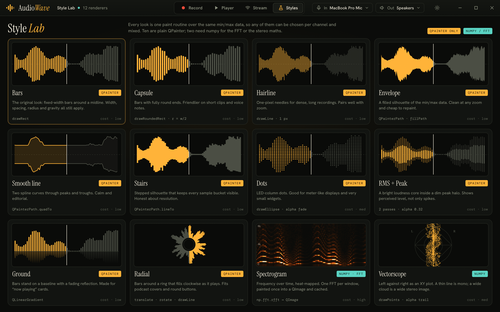

# AudioWave Studio: UI proposal

## Implementation status

The proposal has been implemented as the `studio` app (see [architecture](../architecture.md)); real screenshots are in
[`../screenshots/`](../screenshots). Where the running app differs from the mockups below:

| Mockup | Built |
|--------|-------|
| Stream roles "Server / Client" | **Sender / Receiver.** The mockup mislabelled them: in Mimi Wave the sender is the server and the receiver is the client |
| Stream page shows a sending lane and a receiving lane together | One lane at a time, matching the role chosen |
| Stream "LIVE" mic lane | Implemented as *Stream microphone*, and *Send current take* covers the old "Send Recorded" |
| "PLAYING" badge on the current take | "CURRENT" (a take can be selected while stopped) |
| Hex values printed on colour swatches | Moved to the tooltip; the columns were too narrow |
| Custom window controls | Native title bar |
| RMS + Peak "faked" from the peak | Uses a real RMS envelope from the core |

Built from the feature list: presets, linked/L/R editing, the style picker and Style Lab (12 renderers), spectrogram and
vectorscope views, overview with viewport, loop region, markers, speed, mute/solo, per-channel meters, auto gain, takes,
device pickers, PNG export, light theme, keyboard shortcuts, drag and drop.

Not built yet: loudness/LUFS, live spectrum analyser, trim/cut/fade editing, multi-file compare, recent files, arrow-key
nudge. `detect_silence` exists in `audiowave.core` but has no UI yet.

---

Everything below is the original proposal, kept as written. It refers to the 0.1 classes
(`AudioWaveFormOptions` and friends), which no longer exist; see the README for the new names.

Mockup source: [`mockups/studio.html`](mockups/studio.html). Regenerate the images with [`render.sh`](render.sh).

## Why

The current demo ([`../screenshots/current-ui.png`](../screenshots/current-ui.png)) is a two-column grid of 36 raw
spin boxes and colour buttons next to a magenta player. Every `AudioWaveFormOptions` field is exposed, but nothing
is grouped, previewed or explained. The waveform itself is one style (pixel bars), and the transport is a row of three
buttons.

This proposal keeps **every existing option and class** and changes how they are presented, then adds features that
fall out of data the library already has (min/max arrays, peaks, seek ratio, the Mimi Wave stream).

## Design direction

A dark instrument-panel look: warm near-black surfaces, amber for "played" and the transport, teal for loop/state,
red only for recording. Serif display headings (Instrument Serif), a grotesque for UI text (Hanken Grotesk), and a mono
face for every number (DM Mono). All colours are flat fills, so the whole thing is reproducible with QSS and QPainter.

## Screens

| # | Image | What it shows |
|---|-------|---------------|
| 1 | [01-player.png](01-player.png) / [annotated](02-player-annotated.png) | Player: overview, two-channel waveform, transport, takes, appearance inspector |
| 2 | [03-stream.png](03-stream.png) / [annotated](04-stream-annotated.png) | Mimi Wave stream: connection, sending lane, receiving lane, frames log |
| 3 | [05-style-lab.png](05-style-lab.png) | Twelve waveform renderers side by side |

## Annotation key (screens 1 and 2)

`Existing` = already in the code today. `New` = proposed.

| # | Element | Maps to | Status |
|---|---------|---------|--------|
| 1 | Mode tabs: Record / Player / Stream / Styles | `RecordingAudioWaveForm`, `PlayingAudioWaveForm`, `mimi_wave_ui`, style picker | Existing modes, new shell |
| 2 | Input / output device pickers | `QMediaDevices.audioInputs()/audioOutputs()` passed to `QAudioSource/Sink` | New |
| 3 | File info chips (rate, bit depth, channels, duration, size, peak) | `AudioWave.frame_rate`, `bits`, `channels`, `duration`, `channels_peaks` | Existing data, new display |
| 3 | View switch: Waveform / Spectrogram / Scope | see [Style Lab](#style-lab) | New |
| 4 | Overview minimap with draggable viewport | `AudioWaveChannel.sample(..)` over the whole file | New |
| 5 | Two-channel waveform, ruler, playhead, seeker dots, click-to-seek | `AudioWaveForm`, `setSeekRatio`, `seekColor`, `seekerColor`, `seekerRadius`, `showHLine`, `grid` | Existing |
| 5 | Loop region, markers, M/S per channel, per-channel level meters | | New |
| 6 | Timer, record / stop / play-pause / loop / marker / speed | `TimedLiveAudioWave` (`secondsSignal`, `stateSignal`), `LiveAudioWave.pause/stop` | Existing timer and transport; loop, marker, speed new |
| 7 | Volume, zoom, follow playhead | `LiveAudioWave.setVolume`, `AudioWaveFormOptions.zoom` | Existing options, follow is new |
| 8 | Takes list; a finished recording becomes a take that loads into the player | `recorder_state` handing `byteArray` to the player in `audiowave_examples.py`; `AudioWaveRecorder.save` | Existing hand-off, new list |
| 8 | Save WAV, Export PNG | `AudioWave.save`, `QWidget.grab().save()` | WAV existing, PNG new |
| 9 | Style picker (8 shown, 12 in Style Lab) | `AudioWaveFormOptions` gains a `style` field | New |
| 10 | Target: Linked / L / R | one `AudioWaveFormOptions` per channel today; Linked mirrors edits to both | New |
| 10 | Gravity | `AudioWaveFormGravity` (Average, Min_Max, Min, Max) | Existing |
| 11 | Shape sliders | `pixelWidth`, `pixelSpacing`, `radius`, `scale`, `emptyPixelHeight` | Existing |
| 12 | Colours | `seekColor` (played), `avgColor`/`minColor`/`maxColor` (unplayed), `seekerColor`, `background`, `gridColor` | Existing; Loop colour new |
| 13 | Display toggles | `grid`, `showHLine`, pre-offset and pause-on-end from the old demo | Existing |
| 14 | Stream session: role, host, port (6000–9000), connect state | `MimiWaveWidget.get_port`, `MimiSocket` | Existing; latency readout new |
| 15 | Sending lane, live mic waveform, mute | `LiveAudioWaveForm` fed by `AudioWaveRecorder` | Existing |
| 16 | Receiving lane, buffer, "Frames \| Size", Play recording | `MimiWaveWidget.update_frames_details`, `play_recording` | Existing; buffer meter new |
| 17 | Frames log | `AudioWaveFrames.frame_count`, `size` | Extends the existing "Frame \| Size" label |

### Progressive disclosure in the inspector

The 36 controls become five short groups. Controls that a style does not use are hidden, not greyed out:

- Width / Spacing / Radius show only for bar-type styles (Bars, Capsule, Hairline, Dots, RMS+Peak, Ground, Radial).
- Min and Max colours appear only when Gravity is Min·Max; otherwise one Unplayed colour is enough.
- "Linked" is the default target. Switching to L or R edits one channel's `AudioWaveFormOptions`.

## Style Lab



Each style is one paint routine over the same min/max arrays that `AudioWaveChannel` already produces, so a channel
can switch style without reloading audio. The proposal is a registry keyed by the new `style` option:

```python
class WaveStyle(Protocol):
    def paint(self, p: QPainter, rect: QRectF, bars: list[tuple[int, int]],
              opts: AudioWaveFormOptions, seek_x: float) -> None: ...

STYLES: dict[str, WaveStyle] = {"bars": Bars(), "capsule": Capsule(), ...}
```

| Style | Qt building blocks | Notes |
|-------|--------------------|-------|
| Bars | `drawRect` / `drawRoundedRect` | What `paintMinMax` does today |
| Capsule | `drawRoundedRect`, radius = width / 2 | Bars with `radius` forced |
| Hairline | `drawLine`, 1 px pen | Bars with width 1 |
| Envelope | `QPainterPath`, `fillPath`, `setClipRect` for played/unplayed | Two clipped fills |
| Smooth line | `QPainterPath.quadTo` through peaks and troughs | Optional translucent fill between curves |
| Stairs | `QPainterPath.lineTo` with horizontal steps | Shows real bucket resolution |
| Dots | `drawEllipse` stacked per column, alpha fades outward | Most draw calls of the QPainter styles; cache to a `QPixmap` |
| RMS + Peak | Two bar passes, outer at alpha 0.32 | Needs an RMS array next to min/max (see below) |
| Ground | `QLinearGradient` reflection below a baseline | |
| Radial | `translate` + `rotate` + `drawLine` around a centre | Played fraction sweeps clockwise |
| Spectrogram | `numpy.fft.rfft` per window → heat colour map → `QImage` | Compute once per file, then repaint from cache |
| Vectorscope | `drawPoints` of (L−R, L+R) with alpha trail | Stereo only; mono shows a vertical line |

Played vs unplayed colouring works the same way for every style: paint the shape twice with `setClipRect` on each side of
the seek position. No per-bar colour logic is needed.

The mockup's data for RMS is faked as a fraction of the peak. A real implementation adds `AudioWaveChannel.rms`
(mean of squares per bucket), computed in the same pass that builds `minimums`/`maximums`.

## More features worth considering

Sorted roughly by how cheaply they fit the current code. None require a new dependency other than numpy, which is
optional and only needed for the spectrogram, vectorscope, loudness and silence detection.

**Small, mostly UI**

- Loop region (A–B) with draggable handles on the ruler; `PlayingFixedAudioWaveForm` already owns the seek ratio.
- Markers with names, saved next to the WAV as a small JSON sidecar.
- Follow playhead: auto-scroll the zoomed viewport to keep the seeker visible.
- Playback speed (0.5×–2×): `QAudioSink` has no rate control, so resample the buffer or use `QMediaPlayer.setPlaybackRate`.
- Mute / Solo per channel, and per-channel level meters using `channels_peaks` for the peak hold.
- Drag-and-drop a `.wav` onto the window; recent files list.
- Export PNG / SVG of the current waveform (`QWidget.grab()` or `QSvgGenerator`).
- Presets: save and load a named `AudioWaveFormOptions` as JSON.
- Light theme (all colours are tokens, so this is a palette swap).
- Keyboard: Space play/pause, L loop, M marker, ←/→ nudge, +/− zoom.

**Medium**

- Overview minimap with a draggable viewport rectangle.
- Takes list with auto-numbering, rename, delete, and "save all".
- Silence detection: shade quiet stretches, offer "trim silence" on export.
- Loudness readout (RMS now; LUFS if numpy and a K-weighting filter are added).
- Spectrum analyser (live FFT bars) as another Record-mode view.
- Input / output device pickers via `QMediaDevices`.

**Larger**

- Non-destructive trim / cut / fade on a selection, then Save WAV.
- Stream extras for Mimi Wave: latency, jitter buffer, dropped-frame counter, reconnect.
- Multi-file compare: two files stacked on one shared timeline.
- Plugin hook so third parties can register a `WaveStyle`.

## Constraints and things to decide

1. **Toolkit.** The design assumes PySide6 as in `audiowave/`. `mimi_wave_ui` also has Tk and `qtpy` variants; this proposal covers the Qt one only.
2. **Font licensing / bundling.** The three fonts are open-licence (SIL OFL) but would need to be bundled with `QFontDatabase.addApplicationFont`. Fall back to the system serif / sans / monospace if not.
3. **Performance.** Repainting 10k+ bars per frame is fine for bars, envelope and line. Dots and the spectrogram should render into a cached `QPixmap`/`QImage` and only repaint the playhead each tick.
4. **API compatibility.** `style` defaults to `"bars"` and every existing option keeps its meaning, so current callers are unaffected. Renaming camelCase methods to snake_case is a separate decision.
5. **What "Linked" means.** Proposed: edits apply to both channels' options; if the two ever diverge, the chip shows "Mixed".

## Suggested build order

1. Package the library and add the `style` registry with the existing look as `"bars"` (no visible change).
2. Add Envelope, Capsule, Hairline, Line, Stairs: small, all QPainter.
3. Build the new shell: title bar, transport, inspector with grouped controls, takes.
4. Overview minimap, loop, markers, follow playhead.
5. RMS + Peak (needs the RMS array), Dots, Ground, Radial.
6. Spectrogram and Vectorscope (numpy).
7. Rework the Mimi Wave screen.
